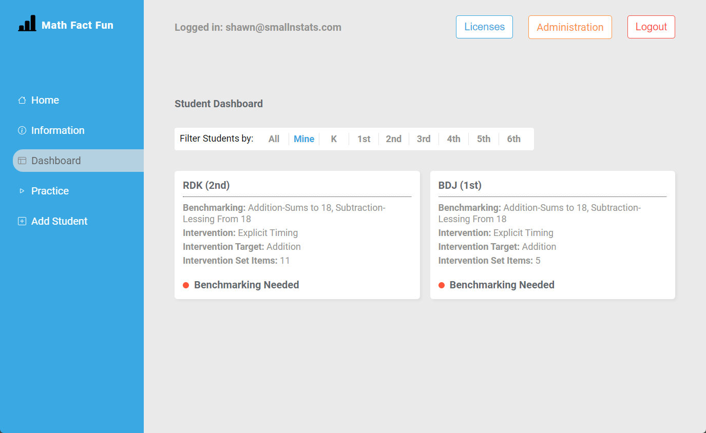
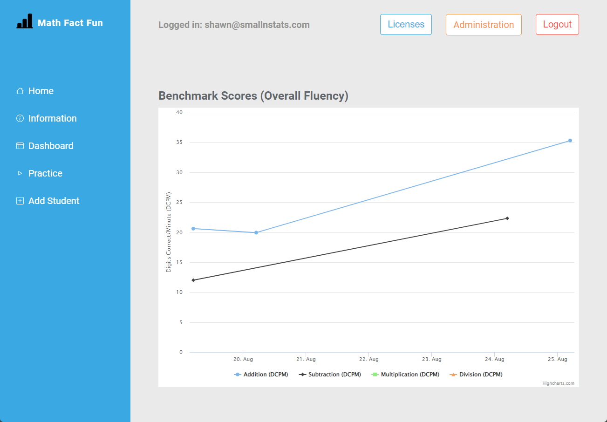
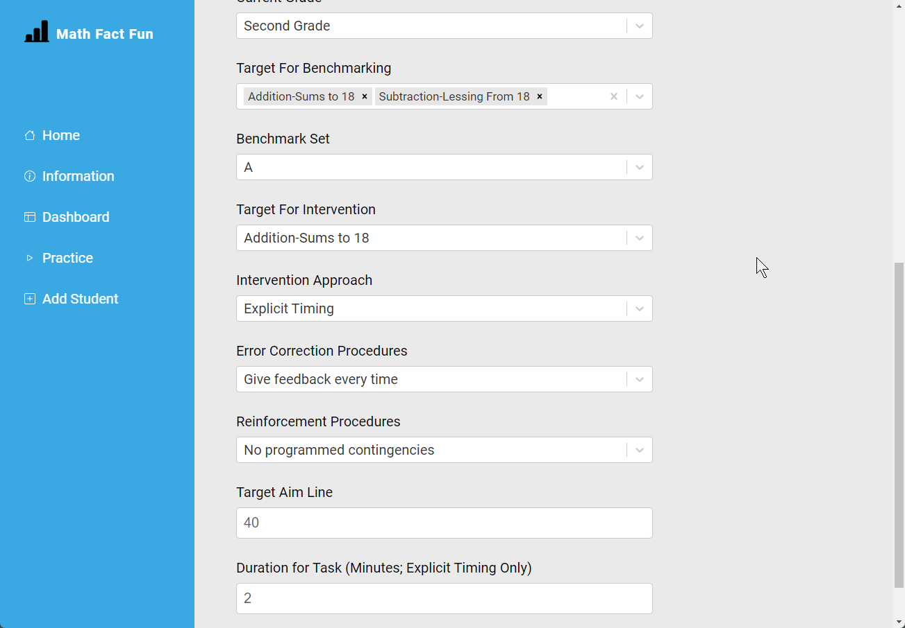
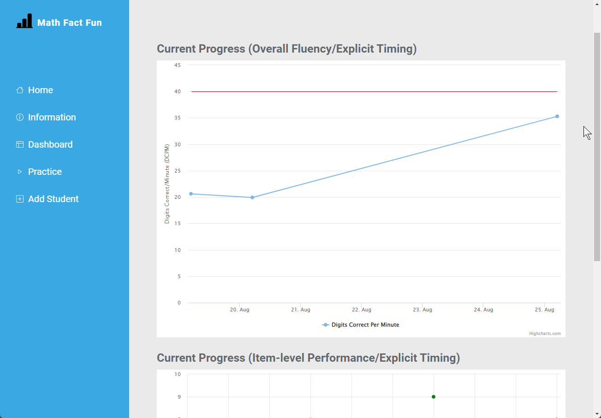
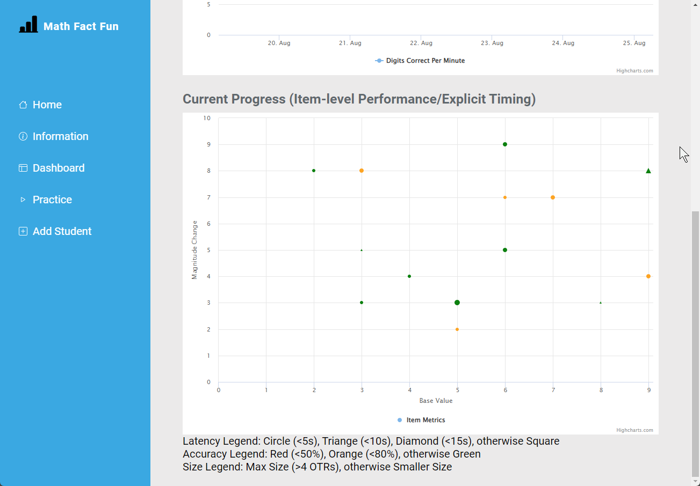
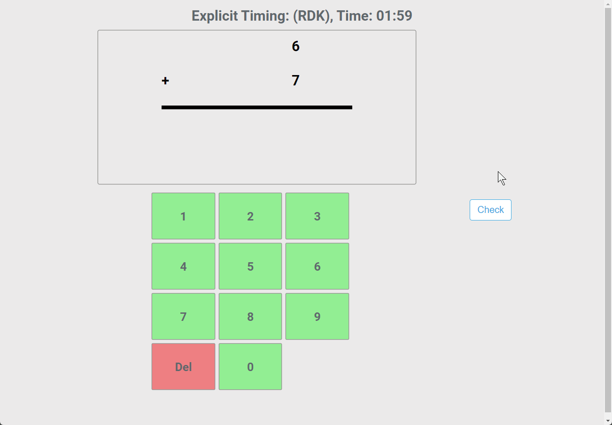
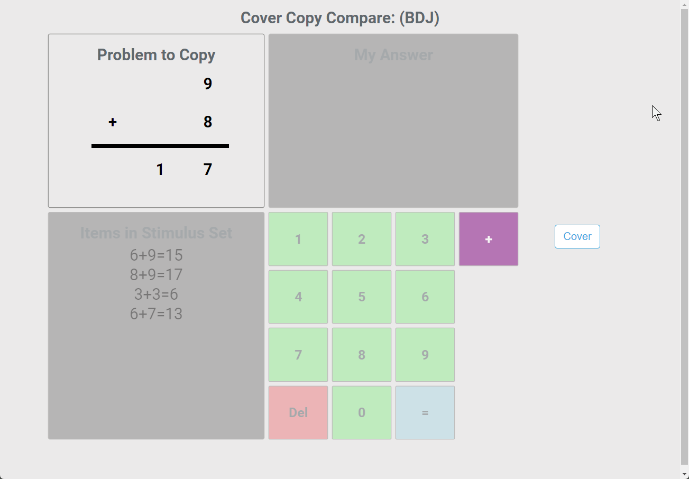

| Statements                                                                            | Branches                                                                               | Functions                                                                           | Lines                                                                      |
| ------------------------------------------------------------------------------------- | -------------------------------------------------------------------------------------- | ----------------------------------------------------------------------------------- | -------------------------------------------------------------------------- |
|  |  |  |  |

# Math Fact Fun (Technology Implementation of MIND Project)

Math Fact Fun (MFF) is a 'high-tech' (i.e., without paper and pencil) translation of work done by Brian Poncy [Brian Poncy](mailto:brian.poncy@okstate.edu) to create the [Measures and Interventions for Numeracy Development (MIND)](https://brianponcy.wixsite.com/mind). At present, MFF is being designed and evaluated as a way to (1) support assist teachers in sampling student performance across a range of declarative and procedural math facts, (2) to identify students who may benefit from additional practice and instructional support, and (3) attempt to deliver 'high-tech' (i.e., without paper and pencil) forms of evidence-based interventions for basic math facts using computer technology. This is an open-source project, created using [React](https://github.com/facebook/create-react-app), and is under active development. Work in the future will include the involvement of other collaborators and community partners.

## MFF Project Core Team

The MFF project currently includes a total of four scientists working across multiple universities. A short bio for each of the members is provided in the space below.

[Shawn P. Gilroy, Ph.D., NCSP BCBA-D LP](mailto:sgilroy1@lsu.edu) (Louisiana State University): Shawn Gilroy is an Assistant Professor of School Psychology and Louisiana State University. His clinical work and research focus on assessment and intervention for various developmental, learning, and behavioral issues of childhood. Shawn has developed numerous forms of technology designed to support evidence-based interventions (e.g., Augmentative and Alternative Communication for non-verbal autistic children). Shawn is the lead developer of MFF.

[Brian Poncy, Ph.D.](mailto:brian.poncy@okstate.edu) (Oklahoma State University): Brian Poncy is an Associate Professor in the College of Education at Oklahoma State University. His research focuses on academic interventions and behavioral principles of learning, specifically in the area of mathematics. His work focuses on the design, selection, implementation, and evaluation of academic interventions and single-case research designs. Brian is a content area expert for MFF and the developer of the MIND program.

[Gary Duhon, Ph.D., BCBA-D, NCSP](mailto:gary.duhon@okstate.edu) (Oklahoma State University): Gary Duhon is a Professor of School Psychology at Oklahoma State University. His teaching and research interests include intervention development, behavioral consultation, pre-referral intervention models, and applied behavior analysis. Gary is a content area expert for MFF.

[Corey Peltier, Ph.D.](mailto:coreypeltier@ou.edu) (University of Oklahoma): Corey Peltier is an Assistant Professor in the Department of Educational Psychology within the Special Education Program at the University of Oklahoma. His research interests include improving the mathematical outcomes for students at-risk or identified with a disability. A secondary line of research focused on the use of single-case designs to identify effective interventions. Corey is a content area expert for MFF.

## Core Goals of MFF

The MFF project was launched as a potential means of addressing challenges associated with delivering curriculum-based measurement and progress monitoring for basic math facts. Specifically, the MFF software was constructed to (1) simplify the administration and scoring of basic math fact probes, (2) assist teachers in quickly and reliably accessing relevant indicators of math fluency, and (3) deliver instructional exercises via software that emulates existing evidence-based practices.

### Goal #1: Quick and Easy Benchmarking of Declarative and Procedural Math Facts

MFF allows teachers/educators to create individual students or batches (e.g., small group, classroom) of students and schedule/assign benchmarking. The dashboard provides an easy way to assist educators in making sure that planned benchmarking occurs as designed. The interface is designed such that a child can be directed to their page (via visiting the page or creating a physical link on the desktop) and their assigned tasks will be presented. MFF will record benchmarking, scoring for digits correct per minute, inter-item latency, performance on individual items, and overall accuracy.

### Goal #2: Support for Identifying Students At-Risk for Learning Issues in Early Math

Educators can set "aim-lines" for individual students and quickly and easily assess whether observed progress conforms with academic expectations for the grade and time (e.g., fall, winter, spring). For example, a teacher may assign Set A for addition sums to 18 and apply a common benchmark of 20 digits correct per minute. Visual inspection of probes can allow teachers to quickly identify students who may be at-risk for learning issues and may benefit from additional support.

### Goal #3: Facilitating Regular Progress Monitoring for Classroom Teachers

The MFF portal allows for both intervention (e.g., Cover-Copy-Compare) and more intense schedules regarding performance. For example, students who may be at-risk can be flagged as needing more frequent probes/benchmarking and the interventionist can set a monthly schedule for data collection across multiple targets (e.g., Addition, Subtraction). Changes to benchmarking/data collection can be made at the individual as well as the batched level.

### Goal #4: Evaluating Computer-based Activities for Improving Basic Math Fact Fluency

Apart from screening and progress monitoring, the MFF portal has several options for facilitating student practice of basic math facts. At present, there are 'high-tech' translations of Cover-Copy-Compare, Explicit Timing, and Taped Problems included in the program. Each of the intervention approaches, as well as guidelines for their use, are derived from the MIND intervention protocols.

Educators using using MFF to deliver intervention have robust options for customization. Individual item sets can be designed based on those included in the MIND package, various error correction and feedback (e.g., reinforcement contingencies) options are available, and parameters related the and can be adjusted (e.g., time frame for Explicit Timing, delay for Taped Problems). Item sets can be adjusted at any time, using a drag-and-drop interface, and all data is immediately available for inspection.

## Illustrations of Functionality

The MFF software supports a range of different intervention and progress monitoring options. For example, which benchmarks to target, whether to intervene upon a specific skill (e.g., math fact fluency), which intervention to use (e.g., Cover Copy Compare), and the various parameters for that intervention (e.g., specific problems in set, error correction procedures, reinforcement contingencies, timing).

Several representative visuals of the software are presented below.

### Benchmarking of Declarative and Procedural Math Facts

### Individual Student-level Progress Monitor/Intervention Settings

### Facilitating Progress Monitoring

### Delivery of Tier II/Tier III Math Intervention for Fluency

## Changelog

- 0.0.1: Initial alpha release

- 0.1.0: first beta release for trial evaluation

## Open Source Licenses

MFF functions by using several excellent open source packages. Each are presented below with attribution (relevant licenses embedded into repo).

[Measures and Interventions for Numeracy Development (MIND)](https://brianponcy.wixsite.com/mind) - Brian Poncy

[firebase](https://github.com/firebase/firebase-js-sdk) - Google (Apache 2.0)

[highcharts](https://github.com/highcharts/highcharts-dist) - Non-Commercial License

[highcharts-react-official](https://github.com/highcharts/highcharts-react) - Highsoft (MIT)

[moment](https://github.com/moment/moment) - JS Foundation and other contributors (MIT)

[react](https://github.com/facebook/react) - Facebook (MIT)

[react-beautiful-dnd](https://github.com/atlassian/react-beautiful-dnd) - Atlassian Pty Ltd (Apache 2.0)

[react-dom](https://github.com/facebook/react) - Facebook (MIT)

[react-modal](https://github.com/reactjs/react-modal) - Ryan Florence (MIT)

[react-router-dom](https://github.com/remix-run/react-router) - Remix Software (MIT)

[react-scripts](https://github.com/facebook/create-react-app) - Facebook (MIT)

[react-select](https://github.com/JedWatson/react-select/tree/master/packages/react-select) - Jed Watson (MIT)

## Software License

MIT-licensed (2022) - Shawn P. Gilroy, Louisiana State University
